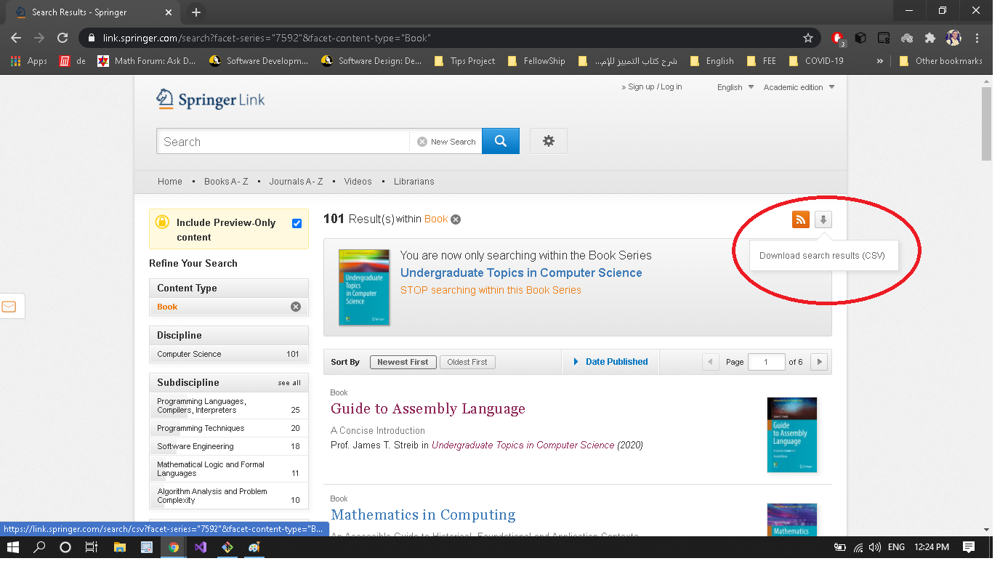

# Download UTiCS
#### UTiCS it's Undergraduate Topics in Computer Science
### UTiCS is a series of books in Computer Science for undergraduate students (about 101 books).
https://link.springer.com/bookseries/7592 
This application is to down this series instead of download each book individual.

### I've used the 'SearchResults.csv' downloaded from the search result (as shown in the last figure) to download the series.

# To download the exe program click <a href="https://raw.githubusercontent.com/IbrahimElsayed26498/Download-UTiCS-books/main/DownloadUTiCS/bin/Debug/DownloadUTiCS.exe" target="_blank">here</a> 

